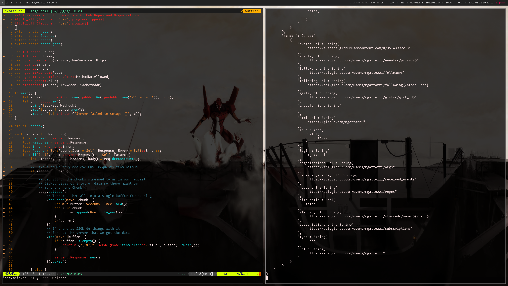

# Building an Asynchronous Hyper Server

Published January 26th, 2017

Recently I started working on a GitHub bot similar to Bors in my spare
time. I decided that I wanted to make the overhead as small as possible
and to use `futures` to harness the power of asynchronous requests. While
`hyper` hasn't fully switched over to this and released yet I decided to
experiment with it and get a server that could take in webhook requests
from GitHub and serialize it to a generic value using `serde`. Hopefully
this helps others in the future so that they too can understand
`futures` and what `hyper` has to offer.

As of this writing I'm using `hyper` at the commit `5c89032` for this. It's
subject to change, but it looks like a good amount of the base
functionality is there for use!

Alright let's get started. First up the configuration file:

```toml
[package]
name = "thearesia"
version = "0.1.0"
authors = ["Michael Gattozzi <mgattozzi@gmail.com>"]
description = "A GitHub bot written in Rust"
repository = "https://github.com/mgattozzi/thearesia.git"
homepage = "https://github.com/mgattozzi/thearesia"

[dependencies]
# Since I control the github-rs API and don't
# plan on releasing this anytime soon for actual use
# I will add it as a github dep
github-rs = { git = "https://github.com/mgattozzi/github-rs" }
hyper = { git = "https://github.com/hyperium/hyper" }
futures = "0.1"
serde = "~0.9.0"
serde_json = "~0.9.0"

[dependencies.clippy]
optional = true
version = "*"

[features]
default = []
dev = ["clippy"]
```

Pretty small in terms of dependencies. We won't be using my `github-rs`
library in this walk through. It's there for future use. What we'll be
needing is the `futures` library, `hyper`, `serde`, and `serde_json` for
this.

Alright let's actually dig into the code:

```rust
//! Thearesia a tool to maintain GitHub Repos and Organizations
#![cfg_attr(feature = "dev", plugin(clippy))]
#![cfg_attr(feature = "dev", plugin)]

extern crate hyper;
extern crate futures;
extern crate serde;
extern crate serde_json;

use futures::Future;
use futures::Stream;
use hyper::server::{Service, NewService, Http};
use hyper::server;
use hyper::error;
use hyper::Method::Post;
use hyper::status::StatusCode::MethodNotAllowed;
use serde_json::Value;
use std::net::{IpAddr, Ipv4Addr, SocketAddr};
```

The `cfg_attr` at the top allows the code to have `clippy` run as a lint
only when passed the `dev` flag. This means it's not needed as an actual
dependency making it easier to migrate the code to Stable Rust in the
future. Neat huh?

Past that we import all the crates we'll be using as well as all the
different types and traits that we'll need. From `futures` we'll need the `Stream` trait
for working with the `Body` from a `server::Request`. We'll
also need `Future` for some trait definitions.

Next up we import the `Service` and `NewService` traits so that we can
configure how we want to handle requests. We also import `Http` so that we
can spawn a `Server` type which will handle requests to it. After that is
a couple of other `hyper` namespace imports and you'll see where these
are used in the code.

We then import `serde_json`'s `Value` type so that we can generically
deserialize anything GitHub sends back. Later on in development specific
types for each type of webhook will be created. Last up we import a few things
from `std::net` to tell what the ip address it should use is.

Cool we made it through a ton of imports so what does our `main`
function look like?

```rust
fn main() {
    let socket = SocketAddr::new(IpAddr::V4(Ipv4Addr::new(127, 0, 0, 1)), 8080);
    let _ = Http::new()
        .bind(&socket, Webhook)
        .map(|server| server.run())
        .map_err(|e| println!("Server failed to setup: {}", e));
}
```

Pretty compact right? The magic is in the `Webhook` `struct` we'll walk
through in a minute. Let's break `main ` down real quickly first.

First up we create a `SocketAddr` for use by the server so it knows what
port to launch on. Next we create a new `Http` type and bind it to the
socket we pass in to it and hand it a type that implements
the `NewService` trait, in this case a `Webhook` `struct`. We then use
`map` to run the server if the value returned from `bind` was an `Ok`. If not it
passes the `Err` value onto `map_err` which will print out the error
if something went wrong and nothing if the server actually started. It's
simple yet effective.

Now let's actually look at the `Webhook` because this is where things
get complicated:

```rust
struct Webhook;

impl NewService for Webhook {
    type Request = server::Request;
    type Response = server::Response;
    type Error = error::Error;
    type Instance = Webhook;
    fn new_service(&self) -> Result<Self::Instance, std::io::Error> {
        Ok(Webhook)
    }
}
```
First up we create the new type. It's as simple as saying `struct Webhook`.
Now we can actually start implementing traits for it! In this case we'll
implement `hyper`'s `NewService` trait. `NewService`'s first three types
have these type constraints if we want to implement a server. It's as
easy as it looks, just tack on those types at the end there. Now what
about this `type Instance`? Well `Instance` is
expecting a type that implements the `Service` trait. In this case we'll
use `Webhook`. We'll implement the `Service` trait for `Webhook` soon! The last
part of implementing the trait is the `new_service` function. Every time
a connection comes in it calls this function to handle the request.
Since we don't need to do any kind of error handling or anything else
here and `Webhook` won't fail to spawn we just return a `Webhook` type
wrapped in an `Ok`.

Alright now let's look at the last bit of the code and the main driver
of requests to the server. It's the `Service` implementation for `Webhook`. It looks
complicated at first but let's break it down bit by bit:

```rust
impl Service for Webhook {
    type Request = server::Request;
    type Response = server::Response;
    type Error = error::Error;
    type Future = Box<Future<Item = Self::Response, Error = Self::Error>>;
    fn call(&self, req: server::Request) -> Self::Future {
        let (method, _, _, _headers, body) = req.deconstruct();

        // Make sure we only recieve POST requests from Github
        if method == Post {

            // Get all of the chunks streamed to us in our request
            // GitHub gives us a lot of data so there might be
            // more than one Chunk
            body.collect()
                // Then put them all into a single buffer for parsing
                .and_then(move |chunk| {
                    let mut buffer: Vec<u8> = Vec::new();
                    for i in chunk {
                        buffer.append(&mut i.to_vec());
                    }
                    Ok(buffer)
                })
                // If there is JSON do things with it
                // Send to the server that we got the data
                .map(move |buffer| {
                    if !buffer.is_empty() {
                        println!("{:#?}", serde_json::from_slice::<Value>(&buffer).unwrap());
                    }

                    server::Response::new()
                }).boxed()

        } else {

            let mut res = server::Response::new();
            res.set_status(MethodNotAllowed);
            futures::finished(res).boxed()

        }
    }
}
```

First off we setup the types for the implementation. The first three are
exactly the same as `NewService`. What's different is our last type in
the trait `Future`. It's expecting something that implements a `Future` as it's
type. We use a `Box` to place our `Future` on the heap and we
say that the `Item` it should return on success is the `Response` type from
this implementation, which is a `server::Response`, and on failure an
`Error` from this implementation. In this case it's an `error::Error`.

Awesome! We've set up all those confusing types so let's actually deal
with some HTTP requests. We do this by creating a `call` function for
the implementation and say it takes a `server::Request` as input and
returns the type we defined for `Future`.

First up we take our method and deconstruct it into it's individual
parts. This code will use the headers in the future but for this we'll
just use the method and body from the request. After deconstruction we
check to see if the method used to hit our server is a POST. If it's not we return
a `MethodNotAllowed` as our status code since we only expect POST to
occur from GitHub webhooks. We return a completed `future` so that this
value is returned immediately to GitHub.

This next part is where we start dealing with `futures` in a more complicated manner.
If the request was a POST we begin processing the body of the request.
The `body` variable is the `Body` type from `hyper`. The `Body`
type implements the `Stream` trait from the `futures` library.
This is a perfect representation for web requests since we might
get the values returned in large chunks. In the case of GitHub it might send
back a 30mb payload depending on the webhook and so we'll have multiple `Chunk`s
sent back through this stream.

The first thing we do is call `collect` on the stream. This will wait
for the `Stream` to get all of the data sent to it and then collect it
all up into a `Vec<Chunk>`. We then call `and_then` so that after
everything is collected we can run our closure we pass to the function.
In this case we `move` the `Vec` into the closure and create a new
buffer of bytes or `Vec<u8>`. We then iterate through each `Chunk`,
turn it into a `Vec` and append it's values to the buffer. This means that
even if all the data came in multiple chunks we stitch it back together again
for deserialization from JSON.

We then wrap it in an `Ok` so that it gets converted to a `Future` so that
we can call the `map` function. This allows us to use the buffer in the
next function! Once we call the `map` function we check if the buffer is empty.
If it's not we deserialize and print out the data! Either way we then create a
200 status code to GitHub so they know the POST from their end was a success.
We then box it up so that we have the right return type and this `Future` gets
returned.

Of course we now have all this code but does it work? Using `ngrok` as
a proxy and a webhook I set up on a repo, I tested the code and here is
what it looks like while being run!



Success! We have a working web server that can handle JSON!

# Conclusion

`futures` is a game changer and this can be a lot to digest while learning it
the first time. It took me a while to get just this code working. I'm still trying
to understand `futures` and what I can do with `hyper` but I can really see how
powerful it's going to be with more examples and clearer documentation
to help guide people. This is pretty exciting stuff! I'm looking forward
to further improving the bot but the first major obstacle is out of the
way!
